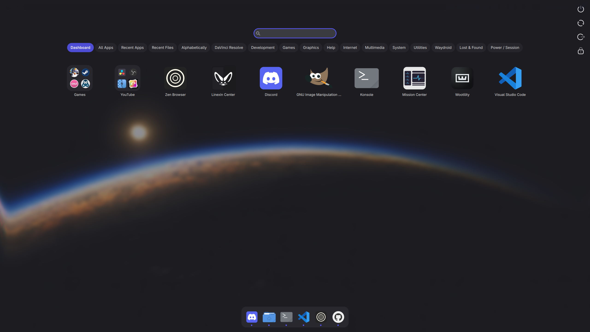
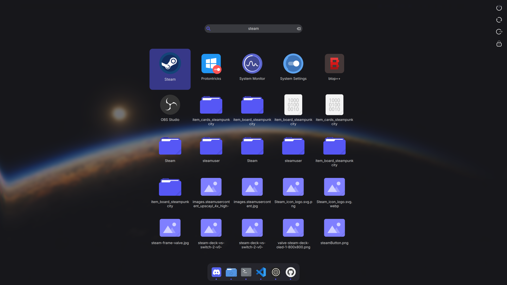
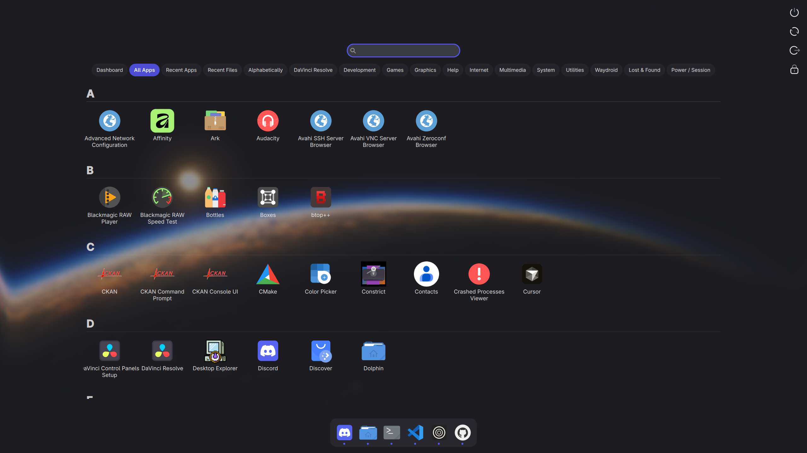
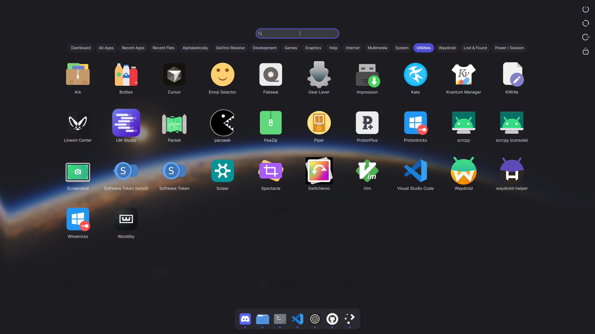

# Linexin Launcher

A fully animated fullscreen plasmoid launcher for **KDE Plasma 6**, combining the best of macOS Launchpad aesthetics with the full functionality of Plasma's Application Dashboard.

## Features

- **Fullscreen overlay** — Takes over the screen like macOS Launchpad and GNOME Shell
- **Expressive, spring-driven animations** — Zoom-into-app launch, folders that unfold from their tile as one glassy surface, lifted and shadowed icon dragging, staggered grid entrance, hover scale and press bounce — Material 3 Expressive in feel, and every timing is tunable
- **Animated folder editing** — Drop one icon on another and it arcs in on a shadowed flight while a glass plate swells beneath it and the new folder springs into being; existing folders gulp what they swallow, and pulling an app back out throws it to its new slot while the card recoils and the icons left behind close the gap
- **Application browser** — Arrange applications on the paginated Dashboard or browse the complete sectioned A–Z view
- **Category filtering** — Filter by application categories with animated pill buttons
- **Search** — Instant search with KRunner integration (apps, settings, bookmarks, files, calculator)
- **Active-app dock** — macOS-style dock for running applications, including activation, new-instance, and window-management actions
- **System actions** — Quick access to shutdown, reboot, logout, lock screen
- **Right-click menus** — Add or remove Dashboard apps, pin to the Task Manager, edit launchers, manage installation, and use runner/file actions
- **Keyboard navigation** — Full Tab/Arrow/Enter/Escape support
- **Configurable** — Animation speed, background opacity, icon sizes, and more

## Screenshots

<table>
  <tr>
    <td></td>
    <td></td>
  </tr>
  <tr>
    <td></td>
    <td></td>
  </tr>
</table>

## Requirements

- KDE Plasma 6.0+
- Qt 6 / Qt Quick

## Installation

```bash
git clone https://github.com/Petexy/kinexin-launcher.git
cd kinexin-launcher
./install.sh
```

Then restart Plasma Shell:
```bash
kquitapp6 plasmashell && kstart plasmashell
```

### Adding to your panel

1. Right-click your panel → **Add Widgets** → search "Linexin Launcher"
2. **Or** right-click your existing Application Menu → **Show Alternatives** → select **Linexin Launcher**

## Uninstallation

```bash
./install.sh --uninstall
```

## Configuration

Right-click the Linexin Launcher icon in your panel → **Configure**:

| Setting | Description |
|---------|-------------|
| Panel icon | Custom icon for the panel button |
| Starting category | Dashboard, All Apps, Recent Apps, or Recent Files |
| App name format | Name only, description, or both |
| Application sorting | Preserve menu order or sort application entries alphabetically |
| Recent categories | Show or hide Recent Apps and Recent Files independently |
| Dashboard and dock | Choose whether Dashboard includes every app and whether the active-app dock is shown |
| Icon sizes | Separate controls for apps, active apps, and system actions |
| Font sizes | Independent scaling for the category bar, Dashboard, All Apps, Recent Apps, and Recent Files |
| Animation timings | Independent 0–1500ms sliders for open/close, app launch, icon entrance, hover effects, folder popup, moving icons, creating a folder, adding to a folder, and removing from a folder (0 = off) |
| Background | 10–95% opacity (default 55%) with an optional custom tint |
| Search scope | Optionally include bookmarks, files, and emails |

## Known upstream limitation

Plasma's separate Recent Apps and Recent Files models currently return at most 15 entries each. Linexin Launcher displays every row those models provide and keeps the two histories strictly separate.

## License

GPL-3.0-or-later
